# Bioinformatics for Resistome-Microbiome Analysis of Shotgun Metagenomic Data

Welcome all to the **Bioinformatics for Resistome-Microbiome Analysis of Shotgun Metagenomic Data** workshop!

We are delighted to engage in meaningful teachings and discussions in metagenomic research.

The Microbial Ecology Group (MEG) workshop lessons are designed to introduce researchers to several important areas of metagenomic research to assess microbiome and resistome data. Participants will learn foundational concepts of metagenomic sequencing, datasets, and research challenges. They will gain practical hands-on bioinformatics skills to execute post-sequencing tools and software on a high-performance linux computing system. Furthermore, they will learn to use the R programming language for statistical analysis of metagenomic output files. As always, we would love to get your feedback and input on how we can continually improve the workshop experience!

One of the goals of the workshop is to help establish a "cohort" of people who are also performing metagenomic analysis, and to put you in contact with each other and with the workshop instructors. This is really helpful after the workshop, when you go home and want to analyze your own data -- you can reach out to this group of people for troubleshooting or for input on your analysis, for example. To start making these connections, we've established a Slack group for the ASM Workshop.

- [Slack invite link](https://join.slack.com/t/asmworkshop20-wwo7481/shared_invite/zt-19ukee7o4-pDxpMxjXl46TkS96yg3nwQ)
  * This link expires every 30 days, so let us know if it doesn't work for you.
- [Slack group: ASM-Workshop-2022 "Resistome Bioinformatics"](asmworkshop20-wwo7481.slack.com)

## Table of Contents

- [Workshop details](#workshop-details)
- [Training portal](#training-portal)
- [Bioinformatics](#bioinformatics)
- [Statistics](#statistics)
- [Resources](#resources-and-additional-information)
- [Special thanks](#special-thanks)

## Workshop details

### Instructors

**Dr. Noelle Noyes** -- nnoyes@umn.edu <br>
The lead instructor for the workshop. She will be providing the lecture material and leading everyone in the hands-on portion of the workshop.

**Peter Ferm** -- fermx014@umn.edu <br>
A workshop instructor, he will be providing on-site support during the workshop.

**Dr. Lee Pinnell** -- ljpinnell@cvm.tamu.edu <br>
A "behind-the-scenes" instructor providing support for the hands-on section of the workshop; he will be monitoring the remote server and providing back-up help as needed during the workshop.

**Dr. Lisa Perez** -- perez@tamu.edu <br>
A system administrator of the Texas A&M HPC resources and a developer for the training portal used for the workshop. She will also be providing remote support during the workshop.

### ASM microbe links

- [ASM Online Planner](https://www.abstractsonline.com/pp8/#!/10522/session/91)
- [ASM Mircobe Homepage](https://asm.org/Events/ASM-Microbe/Home)

### Location

Salon C <br>
Walter E. Washington Convention Center <br>
801 Mount Vernon Place, N.W. <br>
Washington, D.C. 20001

### Date & time

June 9, 2022 <br>
8:00 AM - 4:00 PM	ET

### Agenda

- 8:00-8:15 Instructor introductions and workshop logistics
- 8:15-9:00 Background for bioinformatics
  * 8:15-8:45 Generating metagenomic data
  * 8:45-9:00 The goal of resistome-microbiome bioinformatic analysis
- 9:00-10:30 Overview of AMR++ pipeline and MEGARes database
  * 9:00-9:30 Review MEGARes database, content and structure
  * 9:30-10:00 Review kraken and krakenDB
  * 10:00-10:30 Review AMR++ pipeline
- 10:30am-12:00 Hands-on bioinformatics
  * 10:30-10:45 Connecting to the training portal remote server
  * 10:45-11:15 Setting and running the AMR++ command
  * 11:15-11:45 Review of AMR++ output files
  * 11:45-12:00 Using the portal file transfer feature to download and upload files
- 12:00-1:00 LUNCH BREAK
- 1:00-2:15 Background for statistics
  * 1:00-1:15 Review of “standard” data QC metrics
  * 1:15-1:30 Review of input files for statistical analysis
  * 1:30-1:45 The goal of resistome-microbiome statistical analysis
  * 1:45-2:00 Discussion of confounders and metadata
  * 2:00-2:15 Review of ecological diversity, differential abundance
- 2:15-3:45 Hands-on statistics
  * 2:15-2:30 Launching Rstudio on the portal
  * 2:30-3:00 Using Rstudio on the portal
  * 3:00-3:30 Interpreting the outputs of the R script
  * 3:30-3:45 Where to go for more information
- 3:45-4:00 Wrap-up

### Deliverables

**Upon completion of the workshop, ASM-Microbe participants will be able to:**
- Employ commands in a linux environment.
  * Basic navigation and file structure
  * Running  a Nextflow pipeline via a bash script
- Downloading, uploading, and storing files between local directories and remote repositories
- Understand and interpret different file formats associated with bioinformatic analysis.
  * Fasta and fastq files
  * Count matrix files
  * Metadata files
  * Annotations files
- Describe how metagenomic data are generated, including important pre-sequencing workflow considerations
- Describe the unique characteristics of metagenomic data, and how to handle these characteristics during a microbiome-resistome analysis
- Understand the bioinformatic workflows being used for analysis, and how they impact interpretation of results
- Execute the microbiome and resistome bioinformatic pipeline AMR++, and appropriately interpret the structure and content of the output folders and files
- Use the R programing language to import, store, analyze, and graphically display complex phylogenetic sequencing data.  More specifically: Appropriately calculate, interpret, and discuss common statistical tests and summary statistics.
  * Phyloseq object summary statistics
  * Alpha diversity, including different alpha diversity measures
  * Microbiome and resistome composition
  * Ordination and cluster analysis
  * Measures of association between metadata (including batch effects and primary variables) and microbiome-resistome outcomes

## Training portal

To begin the hands-on portion of the workshop we will load up the training portal. We recommend using Google Chrome due to copy and paste feature that works well with the portal.

Paste this web address into your web browser:

```
portal-lms.hprc.tamu.edu
```

As seen in the image below the dropdown box is where you will place your username and password.

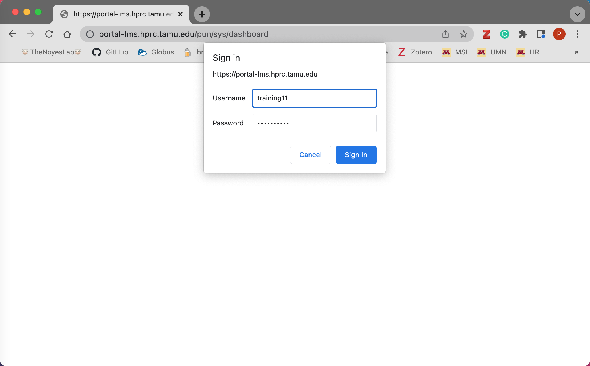

Now that you are logged into your portal dashboard...Click on the ```Files``` dropdown tab and you will be redirected into your training ```home``` directory.

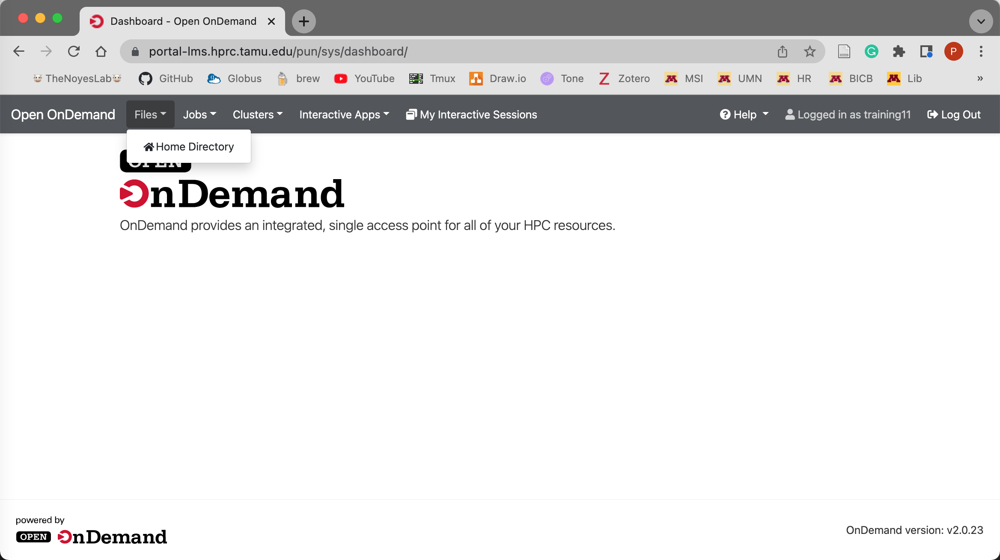

Here, you will experience a GUI file explorer, this is where we can use the feature to ```Upload``` or ```Download``` files to the portal. This will come in handy to download and explore locally, the count matrix output files produced by AMR++.

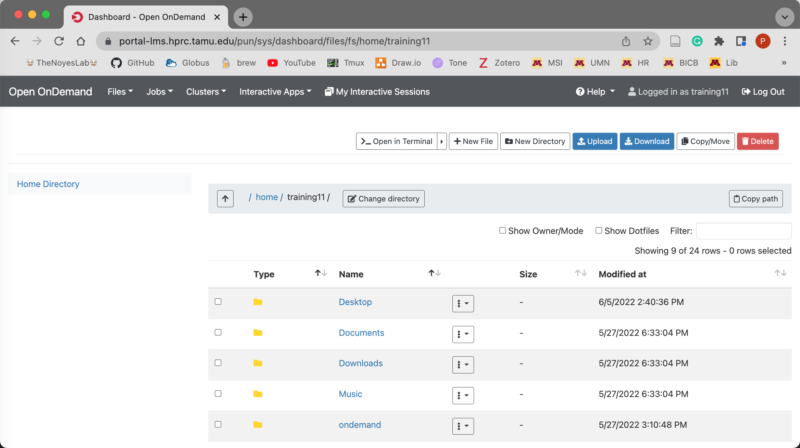

If you are in need of support from our "behind-the-scenes" instructors, we will navigate to the ```My Interactive Sessions``` tab (This will become avialable once we load up a Interactive Desktop in the Bioinformatics section). Once on this page we will right click on the ```View only (Share-able link)```.


This will pull up a new Interactive Desktop tab (as seen in the image below). You will then copy the URL from your web browser and paste this into the ASM Slack group to either Dr. Perez (Lisa Perez) or Dr. Pinnell (ljpinnell). They will now be able to have a live view your Interactive Desktop and be able to help you troubleshoot any problems going on!

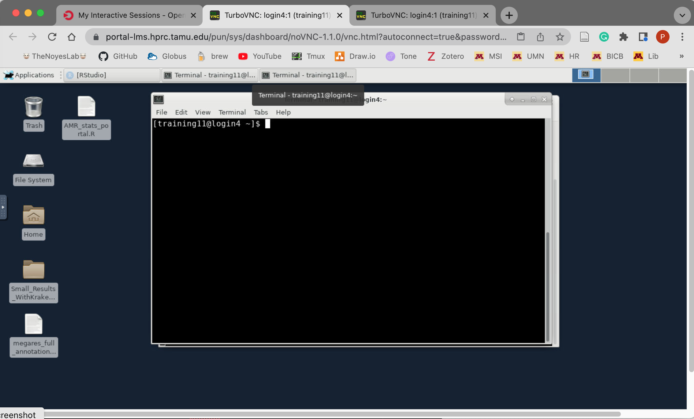

When you are ready to logout of the portal, click the ```Log Out``` tab (top right of your browser). Once loaded, you will then see a message on how to completely log out of the training portal.

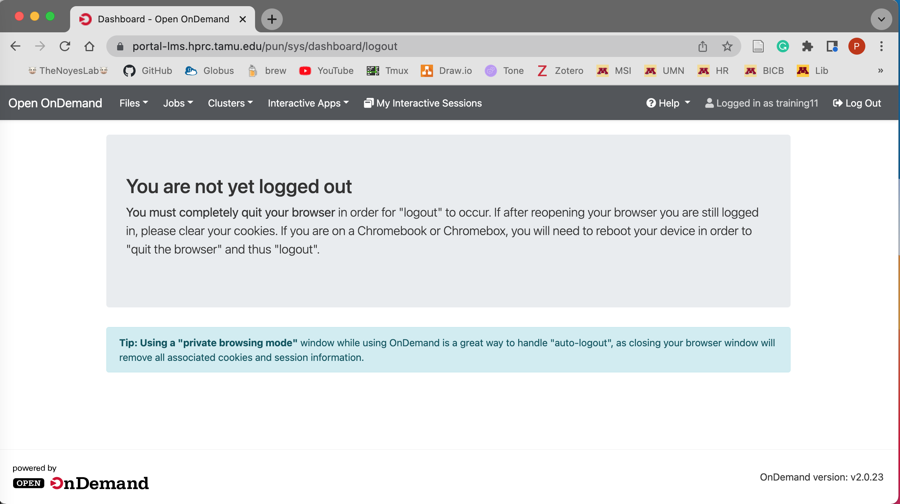


## Bioinformatics

Now from your dashboard we will launch the interactive compute nodes to connect us to the HPC cluster resources. This is where we will run the AMR++ pipeline! Hover over the ```Interactive Apps``` dropdown tab and click on the ```mm Desktop``` button to connect.

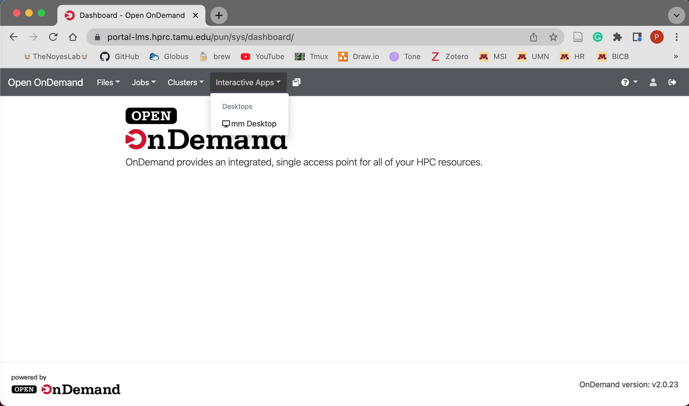

You will now be able to choose the number of hours and cores you want to use for the workshop. Click the ```Launch``` to start the queue to load the Interactive Desktop.

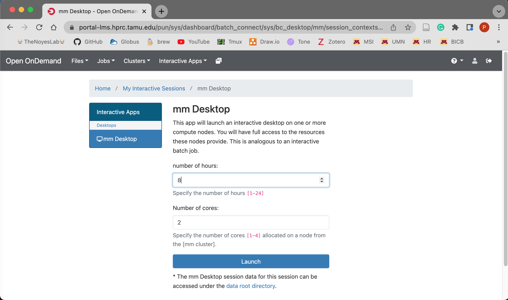

You will be queued for a brief moment and then once your session is created we will click the ```Launch mm Desktop``` button to launch a new web browser tab with your Interactive Desktop.

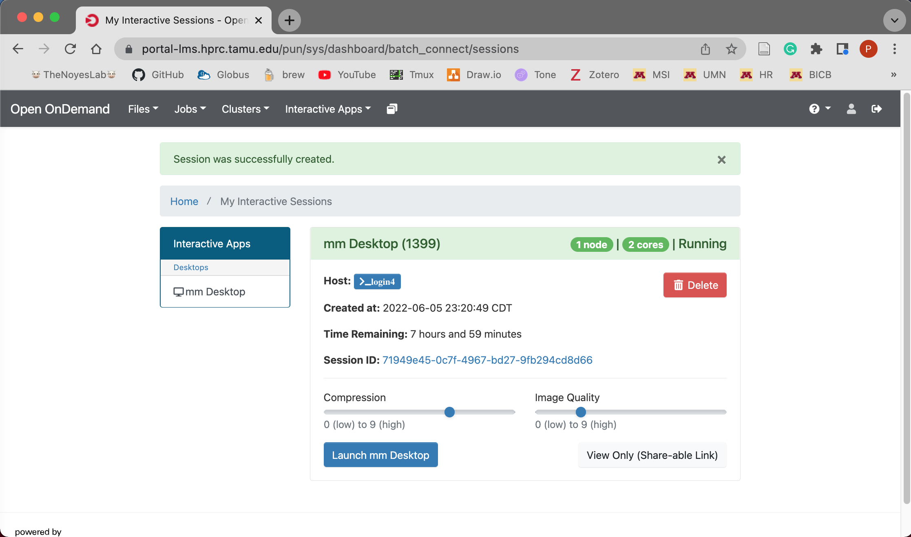

Now on your new Interacivte Desktop tab, click on the terminal emulator app (the second black app at the bottom of the desktop) and then we will begin the command-line portion of the workshop!

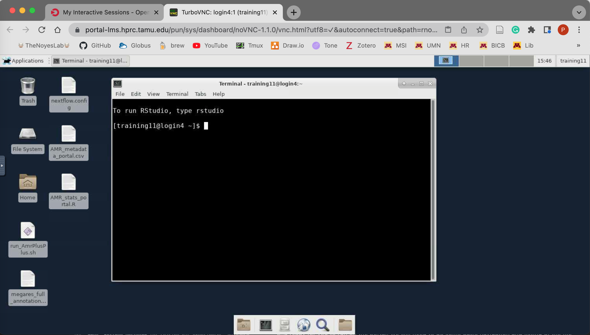

The AMR++ pipeline, the important software dependencies, and configuration files are are pre-installed and ready for you to run on the portal! We will need to do some basic navigation and listing of the file structure before we run the AMR++ pipeline. It is important to note the ```$``` character in the code block examples below represents the end of the command prompt, therefore you will not need to type in or copy it when you run your commands.

The first command we will run is ```pwd```, this stands for "print working directory" and it will print out the ```absolute path``` of where you are currently standing on the file system.
```bash
$ pwd

```

To change directories we will use the ```cd``` command and we will give it the ```relative path``` to your ```Desktop``` directory.
```bash
$ cd Desktop/
```

The ```ls``` command without any options or arguments will output the files and directories of where you are currently standing (i.e. your Desktop).
```bash
$ ls
```


Here you will now see all the files that you will need to run AMR++ and files needed to run the hands-on statistics part of the workshop. The files needed for the AMR++ run will be the bash script ```run_AmrPlusPlus.sh``` and the nextflow congfiguation file ```nextflow.config```.

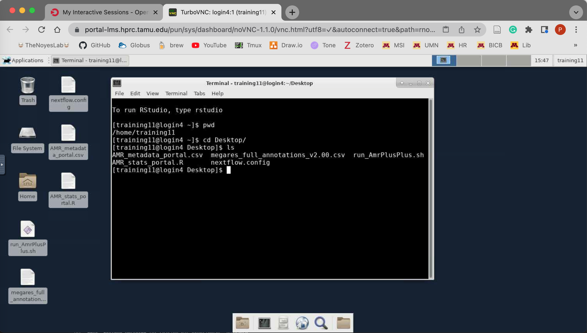

To start your AMR++ run we will run the following command:


```bash
$ bash run_AmrPlusPlus.sh
```

The standard output to the terminal screen is interactive. Once the run has finished it should look similar as the image below:

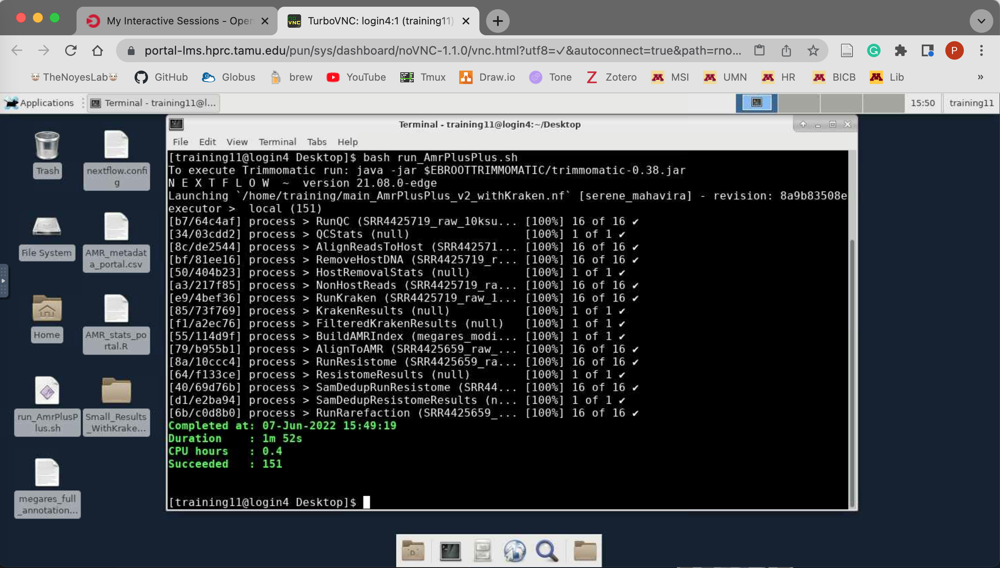


The directory with the AMR++ results will be outputted here in your ```Desktop``` directory where you are currently standing. It will be named ```Small_Results_WithKraken0.1```

There will be several sub-directories within our parent output directory. Within the sub-directories ```ResistomeResults``` and ```KrakenResults``` we will locate our MEGARes resistome and kraken2 microbiome count matrix CSV files respectively. There are also other important output stat files from the run e.g. the ```trimmomatic.stats``` file and the ```host.removal.stats``` file. The image below is a condensed version of the AMR++ output directory structure.

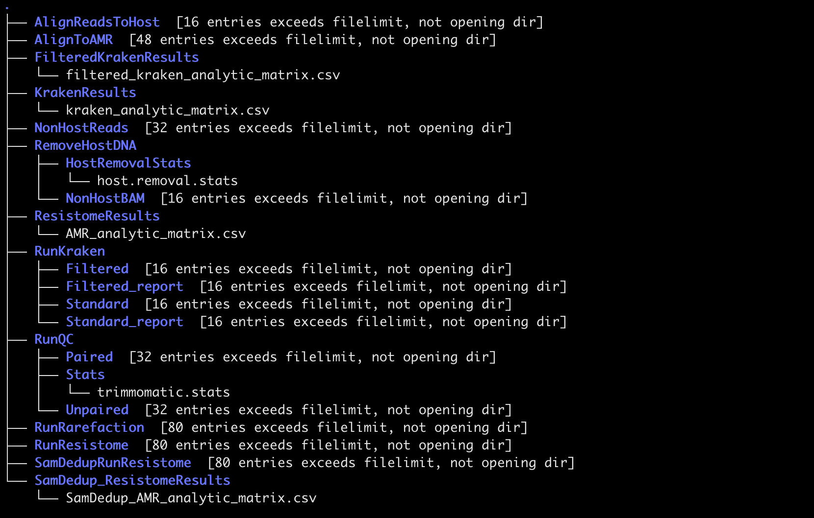

Next we will move back to our portal dashboard and download our AMR++ output files locally to our computers to further explore them!

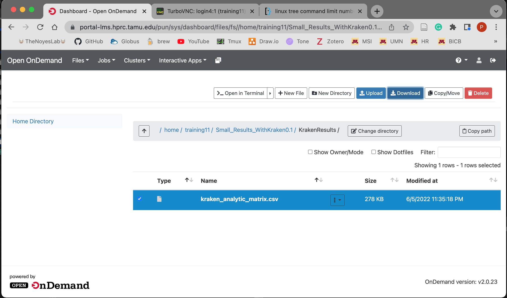

## Statistics

To start the statistics portion of the workshop we will connect back to our Interactive Desktop node. Like before we will navigate to our ```Desktop``` directory. Here is where we will launch the Rstudio application.

```bash
$ rstudio
```
On the bottom right panel of Rstudio in the ```Files``` tab click on the file ```AMR_stats_portal.R```. This will pull up the R script we will use to analyze our metagenomic output files. There are a few different ways to step through the code. You can use the keystroke ```CTRL+Enter``` or ```CTRL+Return```. Or you can use the ```Run``` button at the top of the script. You can also highlight or select specific line(s) you want to run with the keystroke or run button.

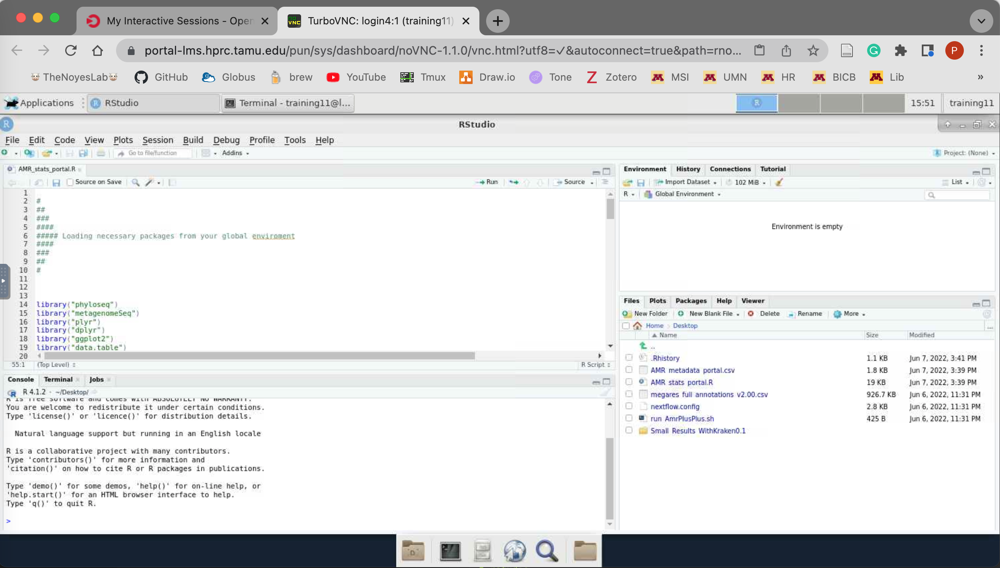

While running the running the R code, if you see the warning below, no worries this may just be due to your computer screen dimensions and the portal.


```
Warning message:
In grid.Call(C_textBounds, as.graphicsAnnot(x$label), x$x, x$y,  :
  X11 used font size 8 when 9 was requested

```

## Resources and additional information

Here are some resources to check out more details and context about the studies, analyses, and tools:

Papers describing the pipeline and database:<br>
- [MEGARes 2.0: a database for classification of antimicrobial drug, biocide and metal resistance determinants in metagenomic sequence data](https://pubmed.ncbi.nlm.nih.gov/31722416/)
- [Improved metagenomic analysis with Kraken 2](https://doi.org/10.1186/s13059-019-1891-0)

Database information:<br>
- [MEGARes Website](https://megares.meglab.org/)
- [Kraken2 Docs](https://github.com/DerrickWood/kraken2/wiki)

Here is a list of recent papers that used the pipeline and database to generate metagenomic results. Some direct links include:<br>
- [A global metagenomic map of urban microbiomesand antimicrobial resistance](https://www.cell.com/cell/pdf/S0092-8674(21)00585-7.pdf)
- [Geographical resistome profiling in the honeybee microbiome reveals resistance gene transfer conferred by mobilizable plasmids](https://microbiomejournal.biomedcentral.com/articles/10.1186/s40168-022-01268-1)

Lab resources:<br>
- [The Noyes Lab Website](https://www.thenoyeslab.org)<br>
- [The VERO Program Website](https://vetmed.tamu.edu/vero/)

Tutorials:<br>
- [Training portal tutorials](https://sites.google.com/tamu.edu/cms)
- [Phyloseq tutorial](https://vaulot.github.io/tutorials/Phyloseq_tutorial.html#content)
- [GUide to STatistical Analysis in Microbial Ecology (GUSTA ME)!](https://mb3is.megx.net/gustame)

Repositories:<br>
- [resources directory](./resources)


GitHub Repositories:<br>
- [AMR++ v2](https://github.com/EnriqueDoster/amrplusplus_v2)
- [AMR++](https://github.com/EnriqueDoster/bioinformatic-nextflow-pipelines)

The code and resources for this workshop was created from following repository below. It has many great lessons, resources, and deliverables to learn from, so to further dig into statistical analysis of metagenomic data check this out! To run locally it is recommended to install the latest version of [R](https://www.r-project.org/) and [Rstudio](https://www.rstudio.com/), then you
will run the ```install_course_packakes.R``` script to install the necessary R packages and their dependencies.  
- [MEG Intro Stats Course](https://github.com/EnriqueDoster/MEG_intro_stats_course)


## Special thanks

**Dr. Enrique Doster** for sharing his experiences, guidance, and code from previous teachings of bioinformatics and statistical analyses for metagenomic research!

**Dr. Paul Morley** for helping with the organization, collaboration, and advisement in preparation of the workshop!

Our hosts **ASM-Microbe-2022** and all faculty and staff.

All of you, the participants! :)
